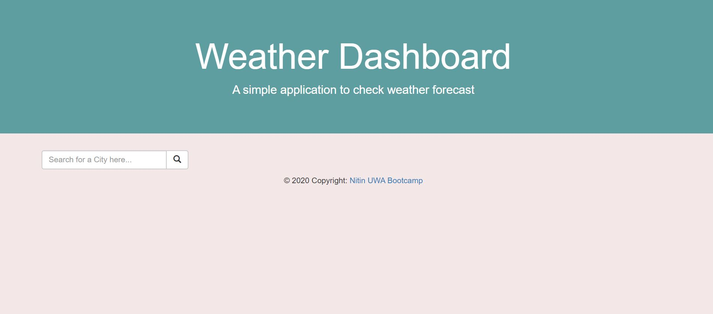
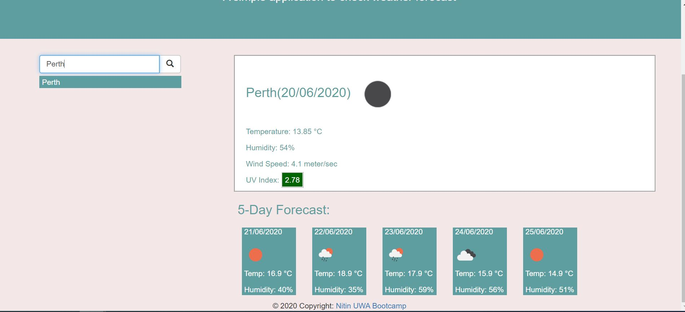
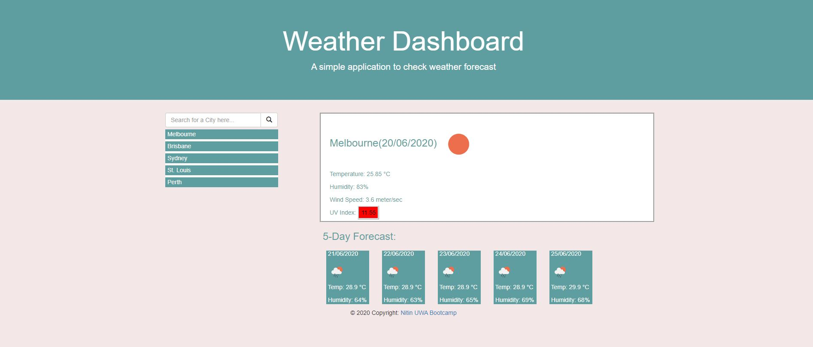
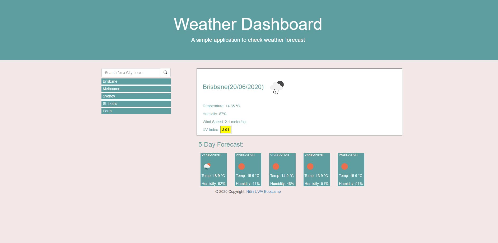

# Description:
It is a weather search application which eature dynamically updated HTML and CSS and can be used to check current day weather and 5 days weather forcast for any city. It uses third party APIs to display weather data.

# Screenshots of built code quiz application:

# Deployed application URL(link):
https://nitinmuk.github.io/weather-dashboard/
